# GAS Project — Step-by-step Guide (Local build, test & monitoring)

## Overview

**This repo contains my personal implementation of the GAS deployment pipeline with CI/CD, monitoring, rollback, blue-green deployment, and canary rollout.**
`What I Tested Locally`

- Application builds successfully
- Tests and linting pass
- Docker container runs locally
- Health endpoint works
- Prometheus metrics exposed
- Blue/Green simulated
- Canary simulated
- Grafana dashboard works
- GitHub workflows validated with act

**This guide walks you through running everything locally, validating behavior, and producing the artifacts required before you push to GitHub.**

## Prerequisites (install on your personal machine)

- Node.js 18+ (or Node 16+)
- npm
- Docker & Docker Compose
- Optional: [act](https://github.com/nektos/act) for local GitHub Actions simulation
- Optional: curl, jq for quick API checks

## 1) Install project dependencies

From the repository root:

```bash
npm install
npm ci
```

## 2) Lint & Test

```bash
npm run lint
npm test
```

- `npm run lint` prints lint errors/warnings. Fix them or adjust `.eslintrc` if needed.
- `npm test` runs unit tests (Jest). Example test located in `tests/unit`.

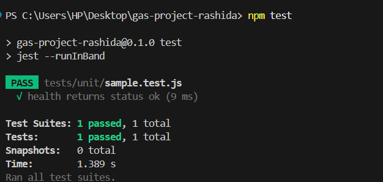

## 3) Run app locally (single container mode)

```bash
npm start
# or for dev
npm run dev
```

Visit:

- [http://localhost:3000/health](http://localhost:3000/health)
- [http://localhost:3000/metrics](http://localhost:3000/metrics)
- CRUD: [http://localhost:3000/api/items](http://localhost:3000/api/items)

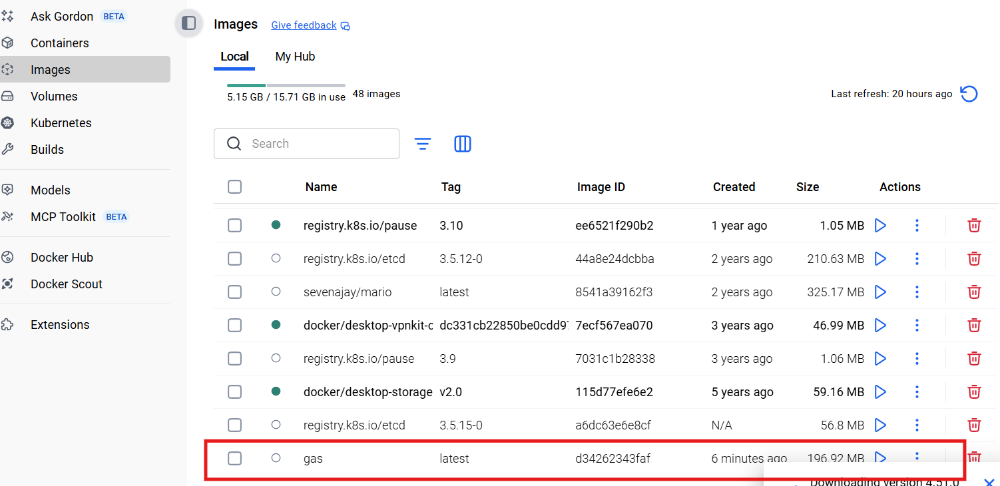

### Monitoring & Health

- Health Check Endpoint
The /health endpoint confirms the application is running and provides service details.

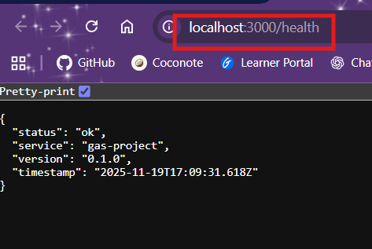

1. **status:** current health status of the app

2. **service:** service name

3. **version:** current app version

4. **timestamp:** UTC time of health check

This endpoint can be used for CI/CD, monitoring, and blue/green or canary deployment checks.

### Prometheus Metrics

Exposed at /metrics for monitoring performance and traffic.


**CPU**
  User CPU: 0.203s
  System CPU: 0.14s
  Total CPU: 0.343s

**Memory**
  Resident: 45.6 MB
  Heap allocated: 10.3 MB
  Heap used: 8.75 MB

**Event Loop**
  Current lag: 0s
  Mean lag: 0.016s
  Max lag: 0.101s

**Resources & Handles**
Active resources: 5
Active handles: 4

**Garbage Collection**
  Incremental GC: ~0.002s
  Major GC: ~0.009s
  Node.js Version: v22.15.0

**HTTP Requests**
  GET /items: 1
  GET /favicon.ico: 1 (404)

#### Notes

- Metrics can be visualized in Grafana.

- Useful for validating performance during local testing, blue/green swaps, and canary releases.

## 4) Docker build & run

- For this step make sure docker desktop is running.

Build:

```bash
docker build -t gas .
```


Run:

```bash
docker run --rm -p 3000:3000 gas
```

Verify:

```bash
curl http://localhost:3000/health
curl http://localhost:3000/metrics | head
```

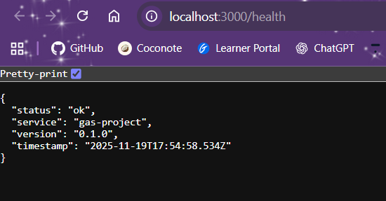


## 5) Full stack with Blue/Green + Observability (docker-compose)

- Change directory into the `docker/` folder and start compose:

```bash
cd docker
docker-compose up --build
```

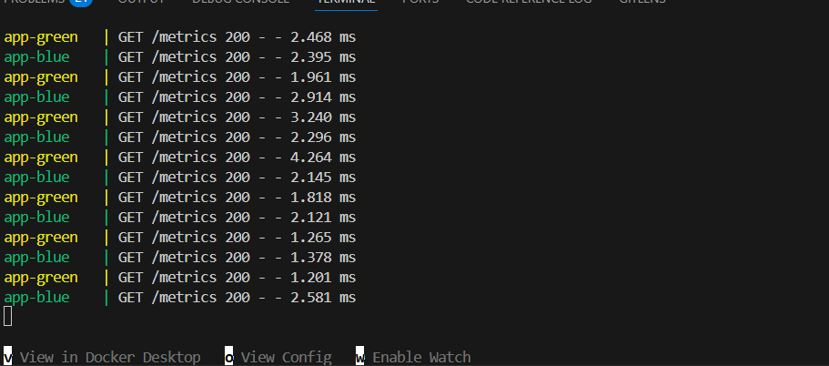
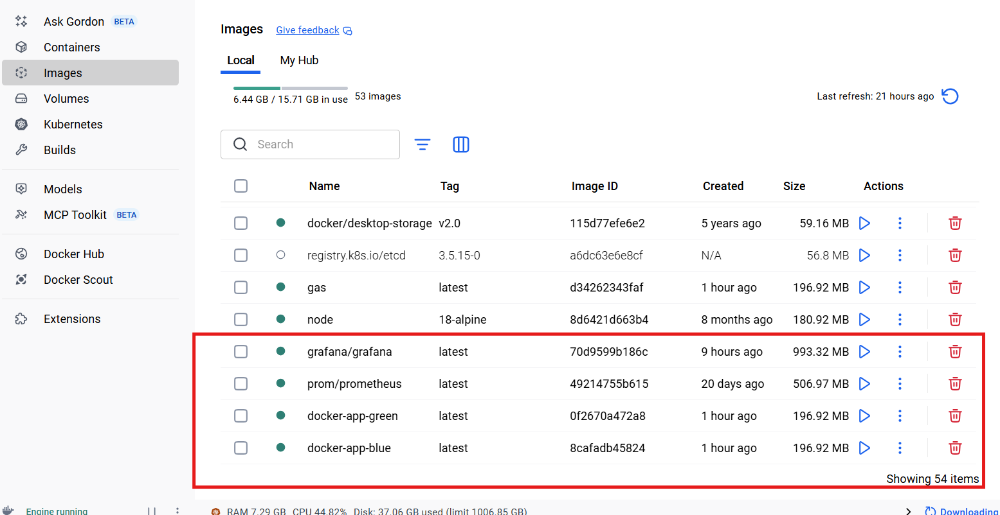

Services:

- Router (entrypoint): [http://localhost:3000](http://localhost:3000)

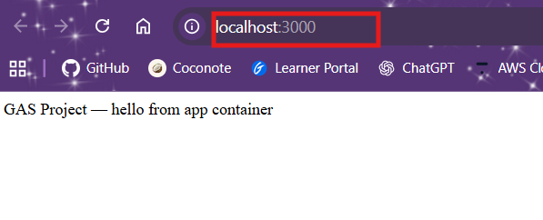

- Blue app: <http://localhost:3001>

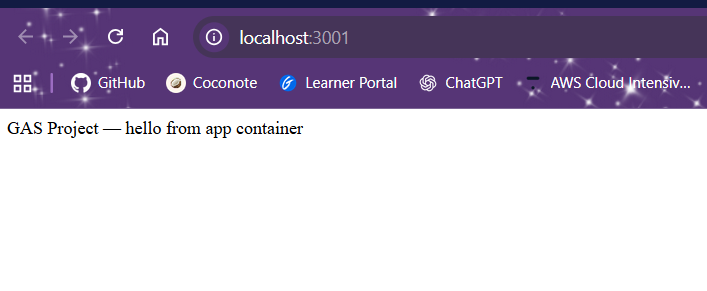

- Green app: <http://localhost:3002>

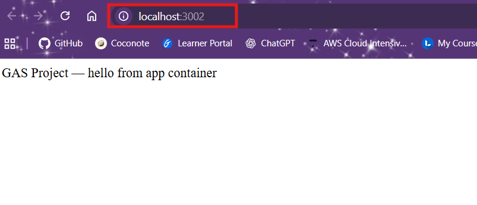

- Prometheus: <http://localhost:9090>

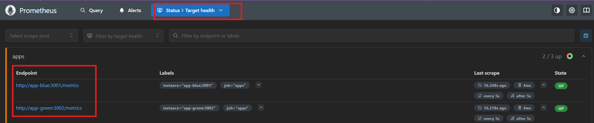

### Router health & canary

- Router health: `http://localhost:8090/router-health`


- Adjust canary by setting `CANARY_PERCENT` in the `docker-compose.yml` reverse-proxy environment (default 10)

**Canary Traffic Simulation – Step by Step**
1️⃣ Open your Docker Compose file

- Locate the docker-compose.yml file (in docker/ folder).

- Look for the reverse-proxy service,:

```bash
services:
  reverse-proxy:
    image: your-reverse-proxy-image
    ports:
      - "3000:3000"
    environment:
      - CANARY_PERCENT=10 # default 10% canary traffic
```

2️⃣ Adjust Canary Traffic

- Change the CANARY_PERCENT value to the desired percentage of traffic to route to the canary (green) container.

Examples:

```bash
environment:
  - CANARY_PERCENT=20  # route 20% of traffic to app-green
```

- The rest of the traffic (80%) will go to app-blue (the stable version).

3️⃣ Restart Docker Compose

- After editing the docker-compose.yml file, restart the services so changes take effect:

```bash
docker-compose down
docker-compose up -d --build
```

4️⃣ Test the Router Health Endpoint

- Verify the router is running and the canary logic is applied:

```bash
curl <http://localhost:8090/router-health>
```

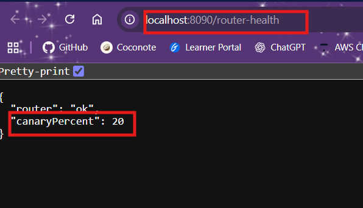

- This ensures the reverse-proxy reloads the new CANARY_PERCENT value.

- Inspect logs of `app-blue` and `app-green` containers to confirm traffic distribution.

5️⃣ Generate Test Traffic

Simulate requests to the router so you can observe traffic distribution:

```bash
1..50 | ForEach-Object { curl http://localhost:3000/items -UseBasicParsing > $null }    # Windows PowerShell
```

- This will send 50 requests to the router.

- The reverse-proxy will route a portion of requests (according to CANARY_PERCENT) to app-green and the rest to app-blue.

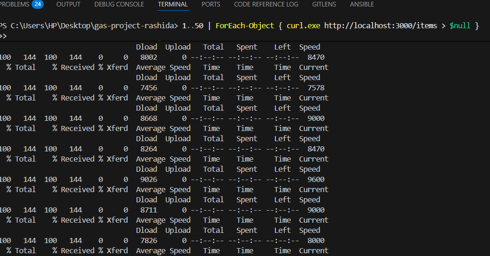

6️⃣ Inspect Logs of App Containers

Check which container received which requests:

```bash
docker logs app-blue
docker logs app-green
```

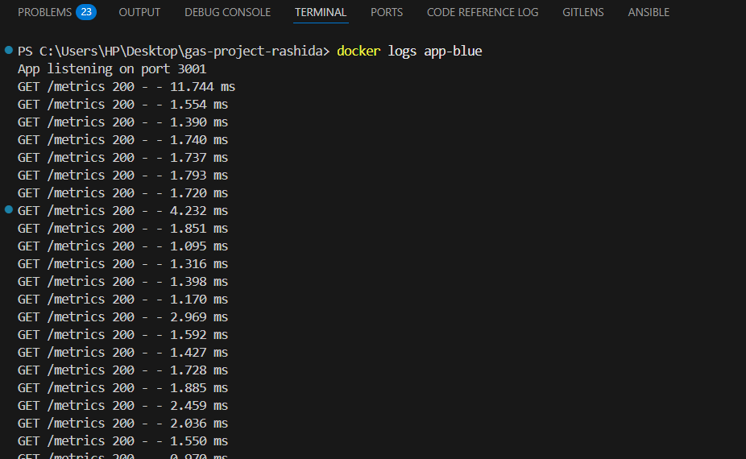
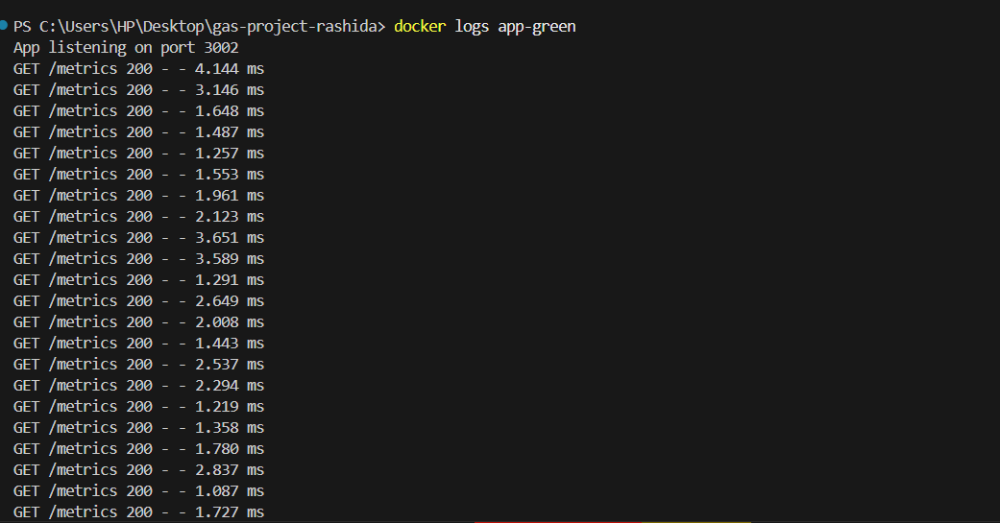

You should see the requests distributed according to your CANARY_PERCENT.

- e.g., 80% of requests in app-green logs

- 20% of requests in app-blue logs

7️⃣ Optional: Automate Logging

You can tail logs live to watch traffic in real time:

```bash
docker logs -f app-blue
docker logs -f app-green
```

Open separate terminals for each container to monitor traffic distribution as you test.

#### ✅ Tips

- Start with a small CANARY_PERCENT (e.g., 10%) to avoid sending too much test traffic to the canary.

- Use multiple requests to get a meaningful traffic distribution.

- Combine this with Prometheus metrics to verify real-time traffic and system performance.

## 6) Validate Prometheus scraping

- Open Prometheus `http://localhost:9090/targets` and ensure targets `app-blue:3001`, `app-green:3002`, and `router:8090` are UP.
- Query metrics like `http_requests_total` or `node_process_cpu_user_seconds_total`.
- Test metrics are visible:

```bash
node_process_cpu_seconds_total
```

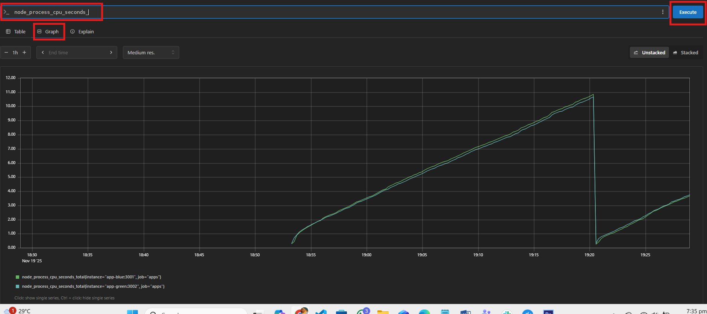

```bash
http_requests_total
```

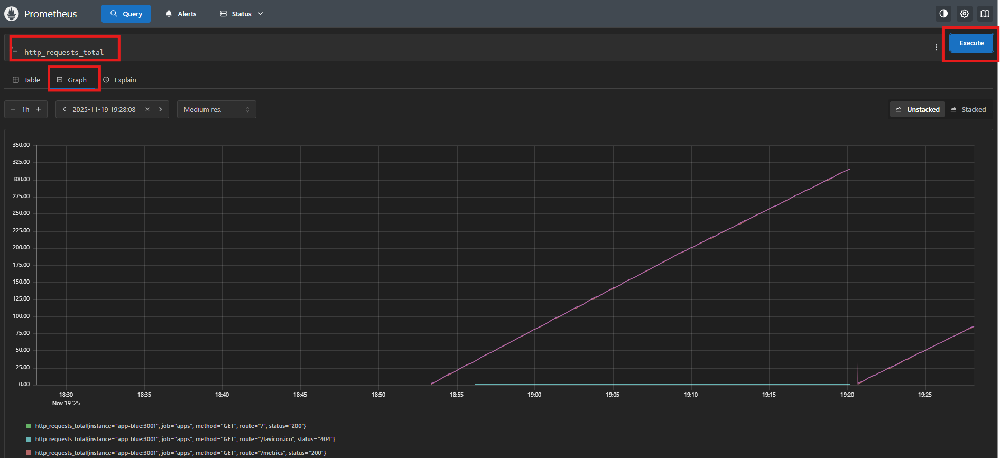

## 7) Grafana Dashboard

- Login to Grafana at `http://localhost:3005` (default admin/admin).
Check Grafana Data Source

Go to Grafana: <http://localhost:3005>
 → Settings → Data Sources → Prometheus

Data source URL should match Prometheus container, e.g.:

<http://prometheus:9090>

- If using Docker Compose, make sure the Grafana container can reach Prometheus. Locally, you may need:

<http://host.docker.internal:9090>

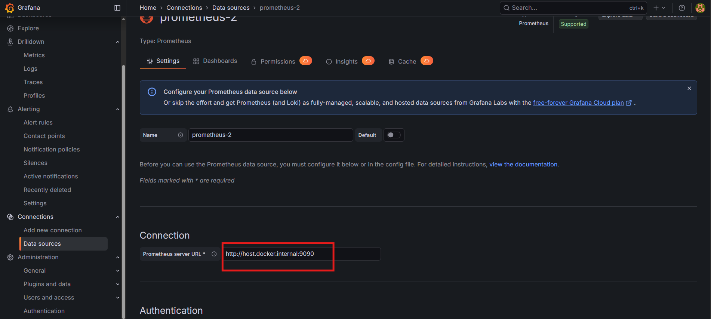

- Click Save & Test — it should say “Data source is working”.

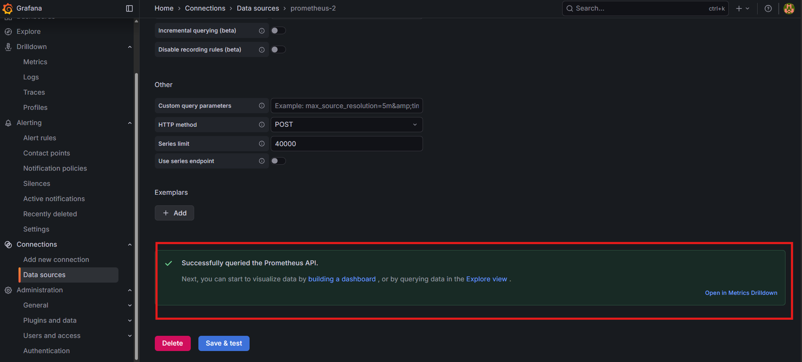

## 8) Blue-Green swap (simulate) optional

- Option A: Set `CANARY_PERCENT=100` so all traffic goes to green (canary promoted)
- Option B: Stop blue container and map stable port to green
- After swap, verify `/health` on stable endpoint and metrics continue to be scraped.

## 9) GitHub Actions dry-run (act)

Install `act`, then from repo root:

```bash
scoop install act
```

```bash
act -j build-and-test
```

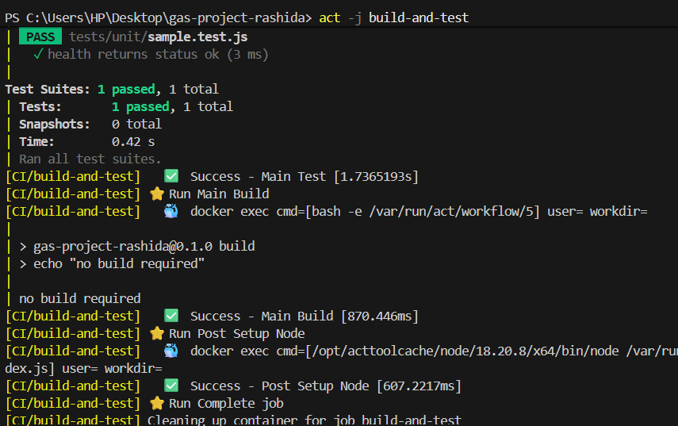

- This will run the CI workflow locally. Fix any issues shown by the runner.

### Note

- If there is an issue with login issues:

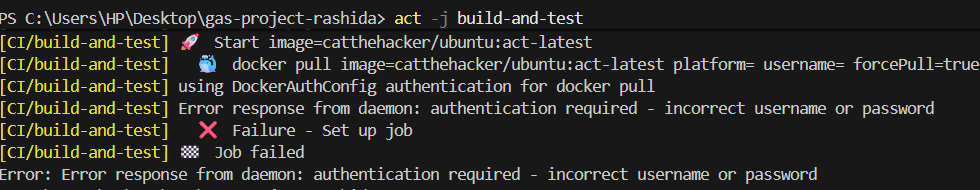

```bash
docker login
docker pull catthehacker/ubuntu:act-latest  # pre-pulled image for act to work properly
 act -j build-and-test  #re-run to test
```

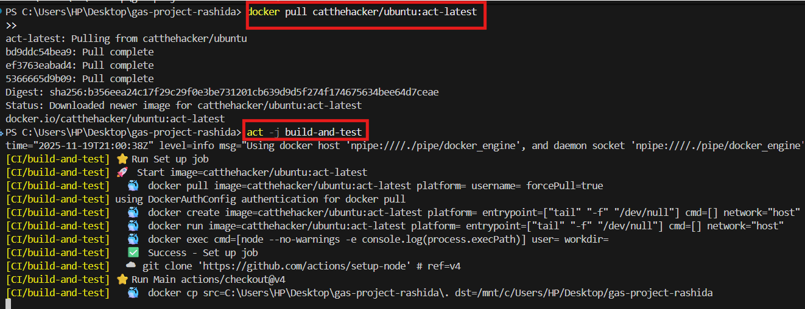

- Build and test deployments.

```bash
act -j deploy-staging
act -j deploy-prod
act -j canary
act -j rollback
```

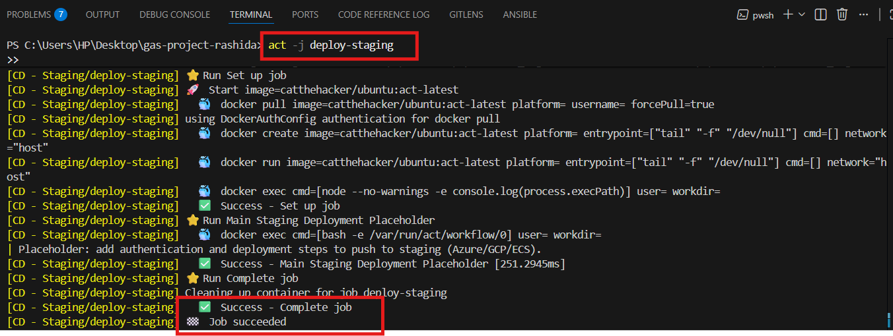
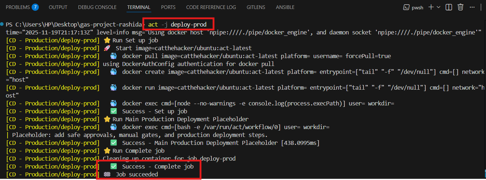
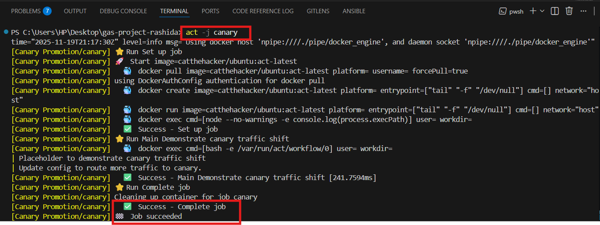
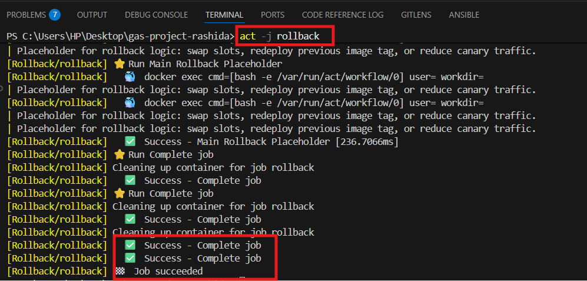

## 10) Checklist before pushing to your personal GitHub

- [ ] App runs locally without errors
- [ ] Docker build & run tested
- [ ] /metrics works
- [ ] /health works
- [ ] Prometheus + Grafana working locally
- [ ] Canary logic simulated locally
- [ ] Blue-Green simulated locally
- [ ] GitHub workflows validate using act
- [ ] Repo follows template
- [ ] Documentation complete

## 12) Push your repo and share for review

- Create a new GitHub repo under your personal account (e.g., `gas-project-your-name`).
- From your local repo root, initialize git, add remote, and push:

```bash
git init
git add .
git commit -m "Initial GAS Project local-first implementation"
git remote add origin git@github.com:your-username/gas-project-your-name.git
git push -u origin main
```

## Troubleshooting tips

- If Prometheus shows BAD_METRIC from your app, check `/metrics` output for invalid labels or NaNs.
- If Grafana panels show no data, confirm Prometheus scrape targets are UP.
- If Docker containers fail to start, inspect logs with `docker logs <container>`.

---

Save this file locally and include it as `README_STEP_BY_STEP.md` in your repo root before pushing.
